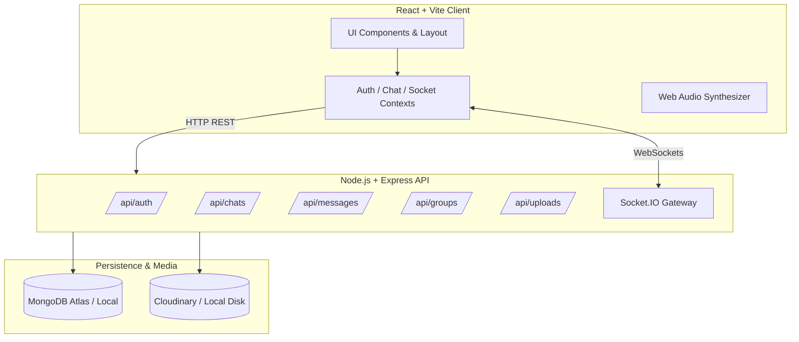

# 💬 TALK-A-TIVE — Modern Full-Stack Real-Time Communication Platform

> **"Conversations that feel alive."**
> A production-grade real-time messaging application inspired by WhatsApp, Discord, Slack, and Telegram, featuring high-speed Socket.IO communication, rich file sharing, dark/AMOLED themes, and enterprise-grade security.

---

## 🌟 Key Features

### ⚡ Real-Time Messaging & Presence
- **Sub-15ms Latency Messaging**: Persistent Socket.IO rooms for direct and group communications.
- **Granular Message Receipts**:
  - `✓` Sent (persisted in database)
  - `✓✓` Delivered (received by recipient's active socket)
  - `✓✓` Read (opened by recipient, rendered in vibrant accent color)
- **Live Debounced Typing Indicators**: Displays *"Rahul is typing..."* or *"Rahul and 2 others are typing..."* with subtle bouncing dots.
- **Real-Time Presence Tracking**: Dynamic online indicator and intelligent last-seen timestamps (*"Active just now"*, *"Last seen 5m ago"*, etc.).

### 👥 Advanced Group Chat System
- **Multi-Step Group Creator**: Interactive member selector with removable chip tags and celebratory confetti animation.
- **Role-Based Group Administration**: Only group admins can rename groups, change avatars, add/remove members, or promote new admins.
- **Secure Group Invite Links**: Generates shareable URLs (`talkative.app/invite/{token}`) allowing users to preview group metadata and join with 1 click.
- **System Event Logging**: Automatically records group actions (*"Rahul created the group"*, *"Priya joined via invite link"*).

### 💬 Rich Message Interactions
- **Emoji Reactions**: Express feelings with ❤️, 👍, 😂, 😮, 😢, and 🔥 with live aggregated counters.
- **Threaded Replies**: Quote preview above the message composer; clicking any reply smoothly scrolls to the original message.
- **Message Editing & Deletion**: Edit own sent messages (labeled with `(edited)`) or soft-delete (*"This message was deleted"*).
- **Inline Copy & Linkify**: One-click text copying with toast feedback; URLs automatically converted into safe, clickable links.

### 📁 Media & Document Sharing
- **Cloudinary Integration**: Cloud storage for high-resolution images and avatars.
- **Automatic Local Fallback**: Automatically stores files on local disk (`server/uploads/`) if Cloudinary keys are not set, guaranteeing zero setup barriers in local development.
- **Instant Lightbox Previews**: Click any shared image to view in a full-screen lightbox.
- **Document Cards**: Displays filename, formatted size (KB/MB), and direct download action.

### 🔍 Search & Performance
- **Command Palette (`Ctrl/Cmd + K`)**: Instant keyboard-accessible modal to jump between active conversations or discover new users.
- **In-Chat Message Search**: Search messages inside any conversation with instant match count and auto-scroll highlighting.
- **Smooth Upward Pagination**: Loads the latest 30 messages initially; scrolling up loads older pages without scroll jumping.

### 🎨 Theme & Accessibility Engine
- **4 Tailored Theme Modes**:
  - **Light Mode**: Fresh, modern SaaS aesthetic with clean borders and subtle shadows.
  - **Dark Mode**: Deep navy and slate surfaces with glowing indigo highlights.
  - **AMOLED Mode**: Pitch black (`#000000`) surfaces tailored for OLED displays and maximum battery efficiency.
  - **Focus Mode**: Distraction-free interface with muted borders, designed for deep work.
- **Compact vs Normal Chat Mode**: Toggleable spacing density.
- **Synthesized Audio Notifications**: Pure Web Audio API tone synthesis — crisp notification bells with zero external audio file dependencies.
- **Browser Push Notifications**: Optional desktop alerts when the application tab is in the background.

---

## 🛠️ Technology Stack

| Layer | Technology |
|---|---|
| **Frontend Framework** | React 18 + Vite |
| **Styling & Design** | Tailwind CSS + CSS Custom Properties (Design Tokens) |
| **Animations** | Framer Motion + Canvas Confetti |
| **Icons** | Lucide React |
| **Routing** | React Router v6 |
| **HTTP Client** | Axios (configured with interceptors) |
| **Real-Time Client** | Socket.IO Client |
| **Backend Runtime** | Node.js + Express.js |
| **Database & ODM** | MongoDB + Mongoose |
| **WebSockets** | Socket.IO Server (Modular Handlers) |
| **Authentication** | JSON Web Tokens (JWT) + Bcryptjs + Google OAuth |
| **File Storage** | Cloudinary SDK (with local disk fallback) |
| **Security Middleware** | Helmet, CORS, Express Rate Limiting |

---

## 🏛️ System Architecture



---

## 📂 Folder Structure

```
ChatApp/
├── package.json               # Root scripts (concurrent dev, seeding)
├── README.md                  # Comprehensive documentation
├── server/
│   ├── package.json           # Backend dependencies
│   ├── .env.example           # Environment variables template
│   ├── uploads/               # Local static file uploads storage
│   └── src/
│       ├── config/            # Database and Cloudinary configuration
│       ├── controllers/       # Business logic (auth, chat, message, group, upload)
│       ├── middleware/        # JWT auth, error handling, multer file validation
│       ├── models/            # Mongoose schemas (User, Chat, Message, Notification)
│       ├── routes/            # Express route declarations
│       ├── sockets/           # Modular Socket.IO handlers (presence, chat, typing)
│       ├── utils/             # JWT generator and database seed script
│       └── server.js          # Master Express & Socket.IO server
└── client/
    ├── package.json           # Frontend dependencies
    ├── vite.config.js         # Vite configuration
    ├── tailwind.config.js     # Tailwind design system configuration
    ├── index.html             # HTML shell with Google Fonts & SEO metadata
    └── src/
        ├── components/
        │   ├── auth/          # Authentication modal & forms
        │   ├── chat/          # Chat lists, message bubbles, composer, popovers
        │   ├── landing/       # Hero, features, security, mockup, footer
        │   ├── layout/        # 3-column desktop layout & responsive sidebar
        │   ├── modals/        # New chat, new group, profile, settings, search
        │   └── ui/            # Avatar, badge, skeleton, modal dialogs
        ├── context/           # Auth, Chat, Socket, Theme, Notification contexts
        ├── services/          # Axios API service modules
        ├── utils/             # Web Audio API chime generator
        ├── pages/             # LandingPage, ChatPage, InviteJoinPage
        ├── index.css          # CSS Variables for Light/Dark/AMOLED/Focus
        ├── App.jsx            # Routing and provider hierarchy
        └── main.jsx           # React DOM root
```

---

## 🚀 Quick Start Guide

### 1. Prerequisites
- **Node.js** (v18 or higher recommended)
- **MongoDB** (Local `mongod` service or MongoDB Atlas connection URI)

### 2. Installation
Install all root, backend, and frontend dependencies with one command:
```bash
npm run install:all
```
*(Or navigate to `server/` and `client/` individually and run `npm install`)*

### 3. Environment Configuration
Backend:
Create `server/.env` based on `server/.env.example`:
```env
PORT=5000
NODE_ENV=development
MONGO_URI=mongodb://127.0.0.1:27017/talkative
JWT_SECRET=talkative_jwt_super_secret_key_production_2026_modern_chat
JWT_EXPIRE=30d
CLIENT_URL=http://localhost:5173

# Optional: Cloudinary credentials (defaults to local storage if blank)
CLOUDINARY_CLOUD_NAME=
CLOUDINARY_API_KEY=
CLOUDINARY_API_SECRET=
```

Frontend:
Create `client/.env` based on `client/.env.example`:
```env
VITE_API_URL=http://localhost:5000/api
VITE_SOCKET_URL=http://localhost:5000
```

### 4. Seed Development Database
Populate the database with realistic demo users, sample conversations, and test messages:
```bash
npm run seed
```

#### Demo Credentials:
| Name | Email | Password | Role |
|---|---|---|---|
| **Rahul Sharma** | `rahul@talkative.com` | `password123` | Lead Engineer |
| **Priya Patel** | `priya@talkative.com` | `password123` | UI/UX Designer |
| **Aman Gupta** | `aman@talkative.com` | `password123` | Backend Architect |
| **Sarah Jenkins** | `sarah@talkative.com` | `password123` | Product Manager |
| **Alex Rivera** | `alex@talkative.com` | `password123` | Cloud Engineer |

### 5. Running the Application
Start both the backend server and frontend development server concurrently:
```bash
npm run dev
```

- **Frontend Application**: `http://localhost:5173`
- **Backend API & WebSockets**: `http://localhost:5000`
- **Health Check**: `http://localhost:5000/api/health`

---

## 📡 REST API Reference

### Authentication (`/api/auth`)
- `POST /api/auth/register` — Create new user account
- `POST /api/auth/login` — Authenticate and receive JWT token
- `POST /api/auth/google` — Google OAuth authentication
- `GET /api/auth/me` — Retrieve current authenticated user profile
- `POST /api/auth/logout` — Update presence to offline and revoke session

### Users (`/api/users`)
- `GET /api/users/search?q={keyword}` — Debounced search across name, username, and email
- `GET /api/users/:id` — Retrieve user public profile and presence
- `PUT /api/users/profile` — Update name, bio, status tag, avatar, and settings
- `POST /api/users/block/:id` — Block user
- `POST /api/users/unblock/:id` — Unblock user
- `GET /api/users/blocked` — List all blocked users

### Chats (`/api/chats`)
- `GET /api/chats` — Fetch all user conversations with unread counts and latest messages
- `POST /api/chats` — Access or create 1-on-1 conversation
- `GET /api/chats/:id` — Fetch conversation details and members

### Messages (`/api/messages`)
- `GET /api/messages/:chatId?limit=30&before={timestamp}` — Paginated message history
- `POST /api/messages` — Send new message with attachments and replyTo metadata
- `PUT /api/messages/:chatId/read` — Mark all messages in conversation as read
- `PUT /api/messages/:id` — Edit message content
- `DELETE /api/messages/:id` — Soft-delete message
- `POST /api/messages/:id/react` — Add/toggle emoji reaction
- `GET /api/messages/:chatId/search?q={keyword}` — Search messages within conversation

### Groups (`/api/groups`)
- `POST /api/groups` — Create new group conversation
- `PUT /api/groups/:id` — Update group name, description, avatar (Admins only)
- `POST /api/groups/:id/members` — Add members to group (Admins only)
- `DELETE /api/groups/:id/members/:userId` — Remove member or leave group
- `PUT /api/groups/:id/admins/:userId` — Promote member to admin
- `DELETE /api/groups/:id/admins/:userId` — Demote admin
- `POST /api/groups/:id/invite-link` — Generate unique invite link token
- `DELETE /api/groups/:id/invite-link` — Revoke invite link
- `GET /api/groups/invite/:token` — Preview group metadata before joining
- `POST /api/groups/invite/:token/join` — Join group via invite token

### Media Uploads (`/api/uploads`)
- `POST /api/uploads` — Multipart form-data file upload (Cloudinary or local static storage)

---

## 🌐 Production Deployment

### Frontend (Vercel)
1. Push project to GitHub.
2. Link the repository to Vercel with root directory set to `client`.
3. Set environment variables:
   - `VITE_API_URL`: Your deployed backend URL (`https://your-api.onrender.com/api`)
   - `VITE_SOCKET_URL`: Your deployed backend URL (`https://your-api.onrender.com`)
4. Deploy!

### Backend (Render / Railway)
1. Create a new Web Service pointing to `server`.
2. Build Command: `npm install`
3. Start Command: `npm start`
4. Set environment variables:
   - `NODE_ENV`: `production`
   - `MONGO_URI`: MongoDB Atlas connection string
   - `JWT_SECRET`: A cryptographically secure secret
   - `CLIENT_URL`: Your Vercel frontend URL (`https://your-app.vercel.app`)
   - `CLOUDINARY_*`: Cloudinary credentials for cloud asset storage
5. Deploy!

---

## 🔒 Security Best Practices
- **Password Protection**: Passwords salted and hashed with Bcrypt before saving.
- **JWT Protection**: Tokens verified via middleware on every protected route.
- **Sanitized Uploads**: Rejection of executable binaries (`.exe`, `.sh`, `.bat`, etc.) with strict MIME checking.
- **Rate Limiting & Helmet**: Protection against brute-force attacks and cross-origin resource exploits.
- **Zero Plaintext Secrets**: Sensitive keys managed strictly through environment variables.

---

## 📄 License
This project is licensed under the MIT License.
